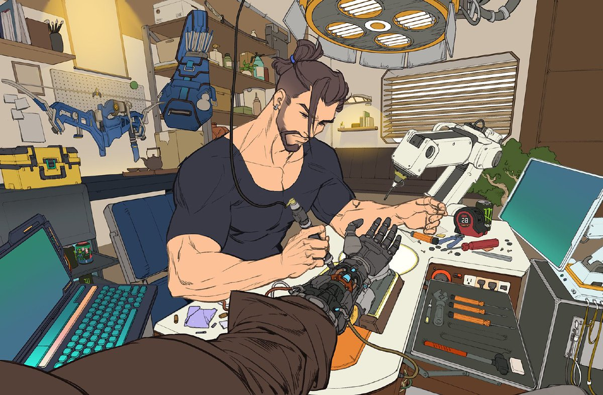

# Awesome Robotics 

> A curated list of awesome resources for Robotics Engineers and hobbyists

A robotics engineer designs, builds, tests, and programs robots and automated systems for industries like manufacturing, aerospace, defense, and healthcare. Combining principles from mechanical, electrical, and software engineering, they create, maintain, and improve machines—such as robotic arms or autonomous systems—to perform precise, repetitive, or dangerous tasks. 

The core challenge: building end-to-end systems that work in the real world.

Robotics isn't a single discipline—it's an integrated intelligence stack.
A modern robotics engineer combines **mathematics**, **physics**, **AI**, **software**, **electronics**, and **embodied systems engineering** to create machines that can perceive, reason, and act in the real world.

## Table of Contents

1. [Mathematics & Physics](./contents/01-mathematics-and-physics.md)
2. [Programming & Systems](./contents/02-programming-and-systems.md)
3. [Mechanics & Electronics](./contents/03-mechanics-and-electronics.md)
4. [Robotics Foundations](./contents/04-robotics-foundations.md)
5. [Perception & AI](./contents/05-perception-and-ai.md)
6. [Autonomous Systems](./contents/06-autonomous-systems.md)
7. [Simulation & Deployment](./contents/07-simulation-and-deployment.md)
8. [Capstone Research & Real-World Projects](./contents/08-capstone-research-and-real-world-projects.md)
9. [Curated Learning Resources](./contents/09-curated-learning-resources.md)
10. [Open Source & Community Engagement](./contents/10-open-source-and-community-engagement.md)

## Core Knowledge Map

Click to expand Core Knowledge Map

### [1. Mathematics & Physics](./contents/01-mathematics-and-physics.md)
> To build precise mathematical models of robot motion and understand the physical laws governing interactions with the real world.

- **Linear Algebra:** Vector spaces, Eigenvalues/Eigenvectors, SVD, and SO(3)/SE(3) Transformations for 3D rotations.
  - [MIT 18.06 Linear Algebra](https://web.mit.edu/18.06/www/)
- **Calculus & Differential Equations:** Multivariable calculus, Jacobian matrices, and ODEs for predicting system states.
- **Optimization:** Linear Programming (LP), Quadratic Programming (QP), and Convex Optimization for path and energy efficiency.
- **Classical Mechanics:** Newtonian Dynamics and Lagrangian Mechanics for modeling complex multi-body systems.
- **Probability & Statistics:** Gaussian Distributions and Bayesian inference for handling sensor noise and uncertainty.
  
### [2. Programming & Systems](./contents/02-programming-and-systems.md)

> To translate theoretical concepts into robust, high-performance, and real-time executable software.

- **Languages**:
  - **Python:** For AI, Research, and Prototyping.
  - **C++:** For Real-time control and High-performance computing.
- **Linux & Ubuntu:** Mastering the standard OS for robotics development and deployment.
- **Git & Software Engineering:** Version control, CI/CD pipelines, and collaborative coding practices.
- **Data Structures & Algorithms:** Efficient computation for real-time decision-making and graph searches.
  
### [3. Mechanics & Electronics](./contents/03-mechanics-and-electronics.md)

> To design and implement physical systems capable of executing software commands and providing accurate environmental feedback.

- Basic Electronics: Fundamental Laws (Ohm/KVL/KCL), Passive/Active Components, and Signal Conditioning (Op-Amps/Filtering).
- Actuators & Sensors: Precision control of BLDC/Servo motors and interfacing with IMUs, Encoders, and LiDAR.
- Embedded Systems: Low-level programming (STM32/ESP32) and industrial communication protocols (CAN bus, I2C, SPI).
- Power Electronics: Designing robust power distribution units and motor driver stages (H-Bridges/ESCs).
  
### [4. Robotics Foundations](./contents/04-robotics-foundations.md)

> To master the core theories of spatial relationships between robot joints and the fundamental principles of feedback control.

- Robot Kinematics & Dynamics: Forward/Inverse kinematics and Recursive Newton-Euler algorithms for torque calculation.
- Control Systems: Classical PID, State-Space Representation, and Modern Optimal Control (LQR/MPC).
  - [Everything You Need to Know About Control Theory](https://youtu.be/lBC1nEq0_nk?si=KfDAPcMwcg5RH74H)
- ROS 2 (Robot Operating System): Distributed system architecture, Node communication, and URDF modeling.
  
### [5. Perception & AI](./contents/05-perception-and-ai.md)

> To enable robots to "see," "interpret," and "learn" from their environment through data-driven approaches.

- Computer Vision: Image processing, Feature extraction, and Deep Learning-based Object Detection.
- State Estimation: Recursive Estimation and Kalman Filtering (EKF/UKF) to determine the robot's true state amidst noise.
- SLAM: Simultaneous Localization and Mapping in unknown or dynamic environments.
- Reinforcement Learning: Training agents to solve complex tasks through trial-and-error in physics-based environments.
  
### [6. Autonomous Systems](./contents/06-autonomous-systems.md)

> To integrate all pillars, allowing robots to make high-level decisions and navigate autonomously and safely.

- Path Planning: Global planners (A, RRT, PRM) and Local trajectory optimization.
- Navigation: Obstacle avoidance, Costmaps, and Behavior Trees for autonomous mission execution.
- Multi-Agent Systems: Swarm robotics and collaborative multi-robot coordination.

### [7. Simulation & Deployment](./contents/07-simulation-and-deployment.md)

> To validate algorithms in safe, high-fidelity virtual environments before hardware deployment, reducing risk and cost.

- Simulators: Utilizing Drake, MuJoCo, or Gazebo for accurate multi-body physics simulation.
- Sim-to-Real: Techniques like Domain Randomization and System Identification to bridge the gap between simulation and reality.

### [8. Capstone Research & Real-World Projects](./contents/08-capstone-research-and-real-world-projects.md)

> To bridge the gap between academic learning and cutting-edge industry/research applications.

- Research Areas: Current Research Problems, State-of-the-Art (SOTA) Algorithms, and Open Challenges.
- Industry Standards: Top Research Labs (MIT CSAIL, CMU RI), Major Conferences (ICRA, IROS), and Benchmark Datasets.

### [9. Curated Learning Resources](./contents/09-curated-learning-resources.md)

> To maintain a continuous learning loop through diverse media and technical documentation.

- Literature: Textbooks, Research Papers (ArXiv), and Industry Insights.
- Media: Technical Blogs, Online Courses, Tutorials, YouTube Channels, and Conference Talks.
  
### [10. Open Source & Community Engagement](./contents/10-open-source-and-community-engagement.md)

> To leverage the global robotics community for collaboration, troubleshooting, and benchmarking.

- cosystem: GitHub Projects (Control Libs, CV Tools), ROS Packages, and [Awesome Curated Lists](./contents/10-open-source-and-community-engagement.md#awesome-projects).
- Engagement: Forums (Discord, Reddit, Stack Overflow) and Competitions (RoboCup, Hackathons, Online Challenges).
  

## Contributing

This repository curates resources, tools, software, and services for Robotics Engineering. If you know of something awesome that should be included, or spot something that needs fixing, we welcome your contributions!

**How to contribute:**
- Found a great resource? Submit a pull request
- Spotted an error or broken link? Open an issue
- Want to suggest improvements? Check our [contributing.md](CONTRIBUTING.md) for guidelines

Let's build this together and help the robotics community thrive.

